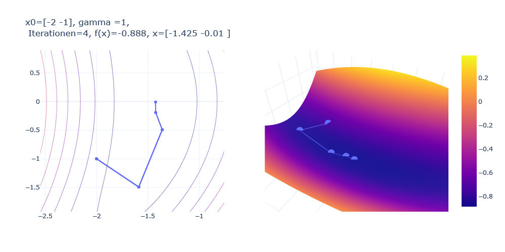

# Nullstellenbestimmung mit dem Newton-Verfahren 

Dieses Notebook biete eine Einführung in das Newton-Verfahren zur Nullstellensuche.

## Lernziele

- In welchen Anwendungsbereichen kommt die Nullstellensuche vor?

- Wie funktioniert das Newton-Verfahren zur Nullstellensuche?

- Wie lässt sich das Newton-Verfahren anwenden, um Extrempunkte von Funktionen
zu finden?

## Zugriff über Binder 

Sie können auf das Notebook über Binder mit dem Link [https://mybinder.org/v2/gh/ahudde/newton/HEAD?labpath=Newton_Nullstellenbestimmung.ipynb](https://mybinder.org/v2/gh/ahudde/newton/HEAD?labpath=Newton_Nullstellenbestimmung.ipynb) zugreifen.

## Lokale Ausführung

Man benötigt die Python-Anaconda Distribution (https://www.anaconda.com/products/individual). Zusätzlich sollte man noch das Paket `plotly` installieren (`conda install plotly in den Anaconda-Prompt eingeben).

## Start

Laden Sie die Dateien `Newton_Nullstellenbestimmung.ipynb`  sowie die 'newton.py' und das 'jpg'-Bild, und legen Sie diese im gleichen Ordner ab. Nun starten Sie Jupyter Notebook, z.B. indem Sie `jupyter notebook` in den Anaconda Prompt eingeben, und navigieren Sie zu der Datei.

Nun können sie die einzelnen Zellen des Notebooks ausführen und sich so in das
Newton-Verfahren einarbeiten. Viele Python-Zellen lassen sich mehrmals hintereinander ausführen, wobei jeweils ein neuer Iterationsschritt gezeigt wird. Am besten probiert man das einfach aus.

Viel Spaß beim Lernen!
